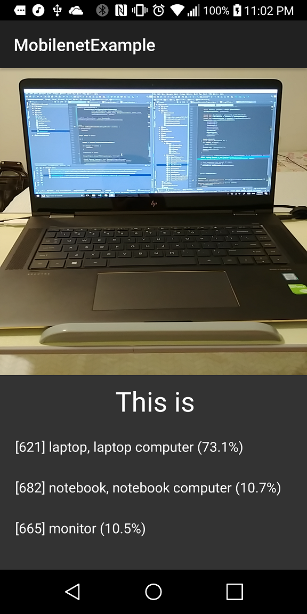

# Tensorflow Mobilenet Example

This example is a practice project of mine and it is mostly referred by [Tensorflow Android Example](https://github.com/tensorflow/tensorflow/tree/master/tensorflow/examples/android).

I wrote a blog post to describe some details. You can go [here](https://wadehuang36.github.io/2017/07/20/offline-image-classifier-on-android.html) to see more information.

## Screenshot

